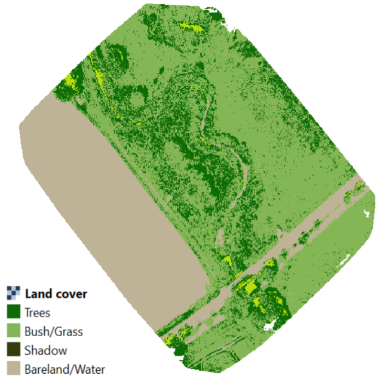
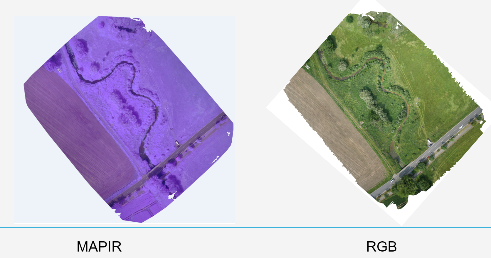
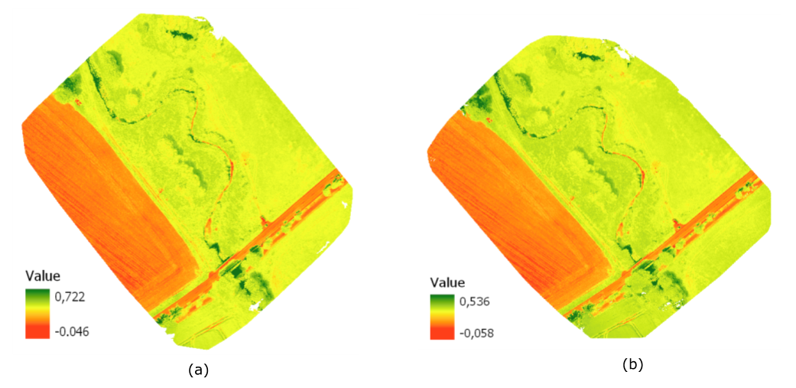

# UAS-AutomatedWorkflow

This is the repository to store the work that has been done by Automated Workflow team for the Unmanned Aerial Systems for Applied Research 2019 in the University of Muenster.

Classification Result

## Content

1. [Docker image to run QGIS 3 Processing Model](https://github.com/ismailsunni/docker-qgis3-model)
2. [Script to run the whole workflow on Linux / macOS](https://github.com/bkari02/UAVWorkflow_Linux_macOS)
3. [Script to run the whole workflow on Window](https://github.com/GulraizKhan-GIS/ODM-QGIS3-Docker-Windows-)
4. [QGIS 3 Processing Model](https://github.com/tinabaidar13/QGIS3_Model)

## Team members

1. Ismail Sunni (team leader)
2. Benjamin Amir Karic
3. Muhammad Gulraiz Khan
4. Tina Baidar

## Other Products

Orthoimages

NDVI Output

